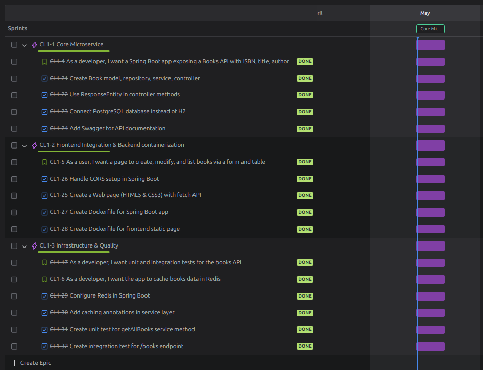
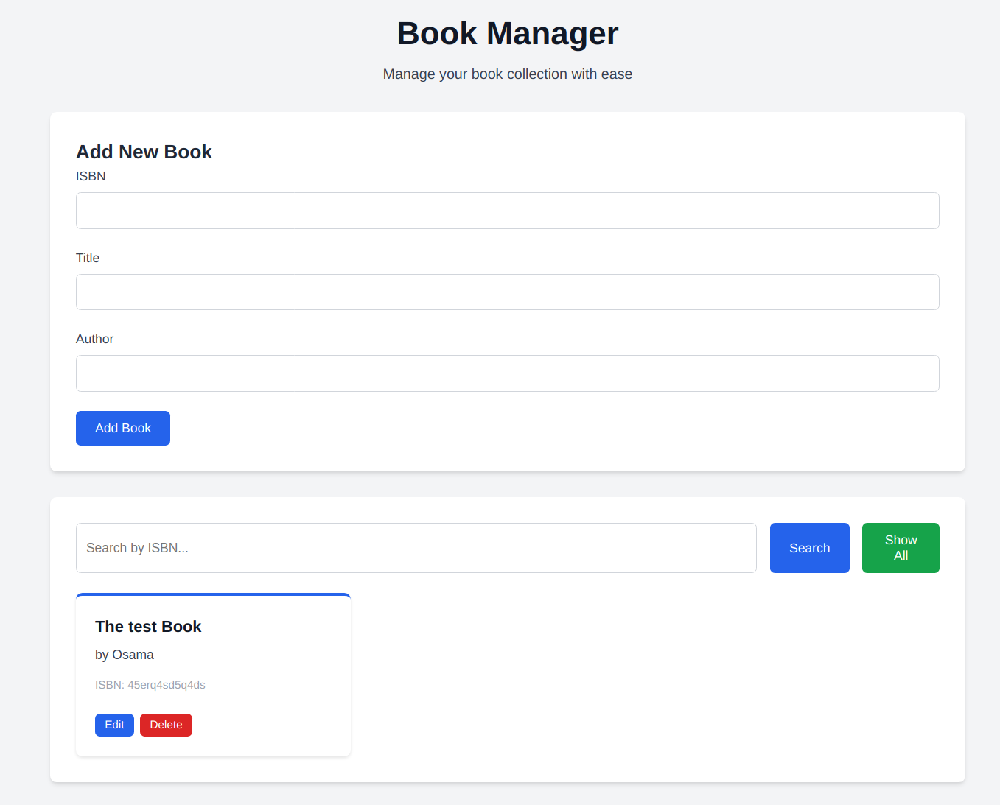
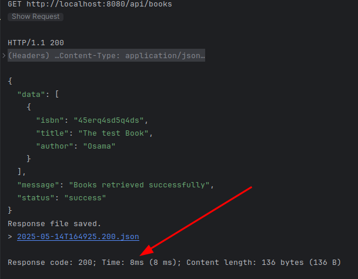
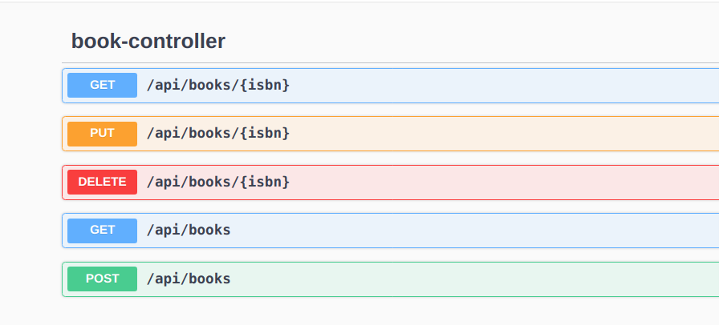

# 📚 Book Manager

A microservice-based web application to manage books, built with **Spring Boot**, **PostgreSQL**, and **Redis**.

## ⚙️ Tech Stack

- **Backend:** Spring Boot (Java)
- **Database:** PostgreSQL
- **Cache:** Redis
- **API Docs:** Swagger
- **Project Management:** Scrum with Jira
- **Testing:** JUnit & Mockito

## 🚀 Features

- Book CRUD operations (Create, Read, Update, Delete)
- Redis caching for fast access
- RESTful APIs with Swagger documentation
- Modular microservice architecture
- Scrum-based workflow tracked in Jira
- Unit & integration tests for service reliability

## 📸 Screenshots

### 📅 Jira board

### 🔗 Project interface

### 🧠 Redis cache view

### 📘 Swagger UI

